# AWS云计算实践

## 总览

AWS是云计算的行业领头羊，其云平台上提供了丰富的组件供客户使用，本项目将使用AWS提供的基础设施(IaaS)，来完成所需基础架构的配置，并在其上运行一个Web应用。本项目使用了很多AWS提供的组件，对一个Web应用的全套基础设施做了一个实践，本项目涉及：

* Web应用：Java Spring Boot(HTTP服务框架)、Postman(接口测试)、JMeter(压测)
* 网络：Internet Gateway(网关)、Route Table(路由表)、Subnet(子网)、Security Group(安全组，出入流量控制)
* 计算：EC2(计算实例)、AMI(实例镜像)、Auto Scaling Group(自动扩缩容)、Lambda(无服务器计算)
* 数据库：RDS(关系型数据库)、DynamoDB(KV数据库)
* 存储：EBS(云硬盘)、S3(对象存储桶)
* 负载均衡：Load Balancer
* 域名解析：Namecheap(域名申请)、Route53(域名管理)、Certificate(证书管理)
* 权限管理：IAM 
* CI/CD：CodeDeploy(自动部署)、Github Workflow(Github工作流)
* 消息队列：SNS
* 邮件系统：SES
* 日志/打点：Cloud Watch
* 密钥管理：KMS

本项目有6个子模块，概况如下：

* [webapp](https://github.com/Captain32/webapp) : Web应用(Java实现)
* [infrastructure](https://github.com/Captain32/infrastructure) : 绝大多数组件配置、创建(Terraform实现)
* [ami](https://github.com/Captain32/ami) : AMI镜像(HCL实现)
* [ami-infrastructure](https://github.com/Captain32/ami-infrastructure) : AMI CI/CD权限策略配置、创建(Terraform实现)
* [app-cicd](https://github.com/Captain32/app-cicd) : Web应用CI/CD权限策略配置、创建(Terraform实现)
* [serverless](https://github.com/Captain32/serverless) : 无服务器计算代码(Python实现)

本项目总体架构鸟瞰图如下：


## 前置工作

1. 本机安装AWS命令行工具
2. 在AWS IAM(权限控制组件，后续会介绍)创建root、dev、prod三个账户以及对应的角色，并赋予相应的权限
3. 在本机`~/.aws`目录下配置`config`和`credentials`文件，示例如下：

```
config文件示例

[profile rootadmin]
region = us-east-1
[profile devadmin]
region = us-east-1
[profile devrole]
region = us-east-1
role_arn = arn:aws:iam::***********:role/dev_account
source_profile = devadmin
[profile prodadmin]
region = us-east-1
[profile prodrole]
region = us-east-1
role_arn = arn:aws:iam::***********:role/prod_account
source_profile = prodadmin
```

```
credentials文件示例

[rootadmin]
aws_access_key_id = *************
aws_secret_access_key = *************
[devadmin]
aws_access_key_id = *************
aws_secret_access_key = *************
[prodadmin]
aws_access_key_id = *************
aws_secret_access_key = *************
```
之后便可以在本机使用AWS命令行工具用对应的角色进行各样操作。

## Web应用

本部分在子项目[webapp](https://github.com/Captain32/webapp)中实现。使用Java的SpringBoot框架实现了若干Restful风格的Http接口，功能包括用户信息注册、修改、查询，文件上传、下载，接口功能较为简单，主要是为了对AWS各个组件的实践，由于Web应用在AWS的EC2实例上运行，所以其中不乏与AWS的RDS、S3、SNS等的交互。

## VPC(虚拟私有云——网络部分)

本部分在子项目[infrastructure](https://github.com/Captain32/infrastructure)中实现。

VPC全称是Virtual Private Cloud，最早是由AWS在2009年提出，直译是虚拟私有云。但是在有时也被翻译成私有网络或者专有网络等。究竟是云还是网络就很让人迷惑。对于基础架构服务，云就是指资源池，VPC是运行在公有云上，将一部分公有云资源为某个用户隔离出来，给这个用户私有使用的资源的集合。云主机只能使用VPC内部的对应的元素。从这个角度看，VPC更像是公有云服务商以打包的形式提供服务。

VPC内部有用户专属的网络以及组件，通过网关(gateway)与外部连接，VPC内部的IP地址则可以自由分配，大致结构如图：


在子项目[infrastructure](https://github.com/Captain32/infrastructure)中，通过配置资源`aws_vpc`、`aws_subnet`、`aws_route_table`、`aws_internet_gateway`来分别配置VPC、子网、路由表和网关，这里设置了三个子网，并且把每个子网都加入路由表中(通过配置资源`aws_route_table_association`)，这样就配置好了最基本网络结构，代码详见子项目[infrastructure](https://github.com/Captain32/infrastructure)，运行代码后效果如下：
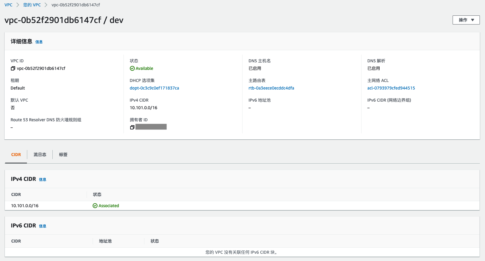
这里创建了dev环境的VPC，该VPC的子网IP域为`10.101.0.0/16`，子网掩码有16位，剩下16位可以自行分配。


这里创建了三个子网，每个子网都关联到了VPC和VPC内的路由表，子网掩码为24位，剩下8位可以在子网内自行分配。

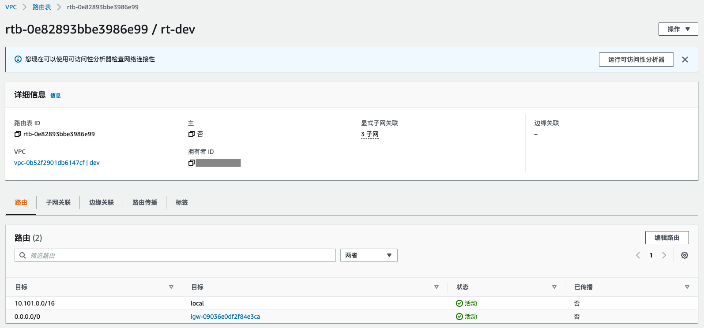

这里创建了VPC内的路由表，并且关联到网关以及刚刚创建的三个子网。


这里创建了网关并且关联到VPC。

## Security Group(出入流量控制)

本部分在子项目[infrastructure](https://github.com/Captain32/infrastructure)中实现。

安全组(Security Group)本是VPC的一部分，这里单独拿出来说，从VPC结构图可以看到一个子网可以有多个安全组，每个实例可以关联一个安全组，安全组定义了实例的访问规则，包括出入流量的配置，可以通过配置一个实例的入流量使得实例只能被指定来源的请求访问，保证了实例的安全性。安全组的配置通过用资源`aws_security_group`实现，在本项目中，分别为EC2实例、RDS实例、Load Balancer配置了安全组，代码详见子项目[infrastructure](https://github.com/Captain32/infrastructure)，运行代码后效果如下：
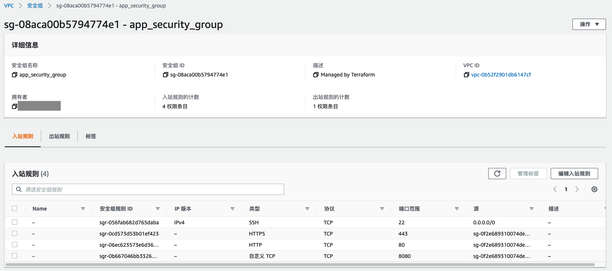
这里为EC2实例创建了安全组，入站流量允许四个来源，一个是任意ip都可以ssh登陆(这里其实不安全哈，为了自己登陆方便，实际不要这么搞)，剩下三个只能通过Load Balancer入站。

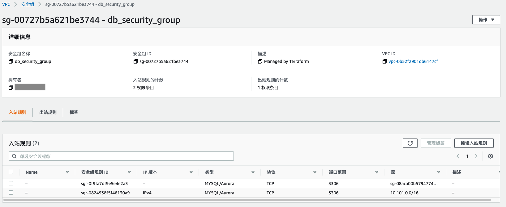
这里为RDS数据库实例创建了安全组，入站流量只允许EC2实例和VPC内的入站请求，并且只开通3306端口用于MySQL连接，防止外部请求直接访问数据库。


这里为Load Balancer创建了安全组，负载均衡器用于接受外部请求并将请求分发给EC2实例进行处理，所以允许所有IP对HTTPS端口的入流量。

## AMI(实例镜像)

本部分在子项目[ami](https://github.com/Captain32/ami)中实现。

AMI是AWS中的镜像，由于项目需要，每次启动EC2实例我们都需要安装Java运行环境、自动部署、日志、指标上报组件，所以为EC2实例创建一个镜像是最合适的方法，之后每次启动EC2实例只需要从镜像启动即可，代码详见项子项目[ami](https://github.com/Captain32/ami)，运行代码后便可以创建镜像，如下：
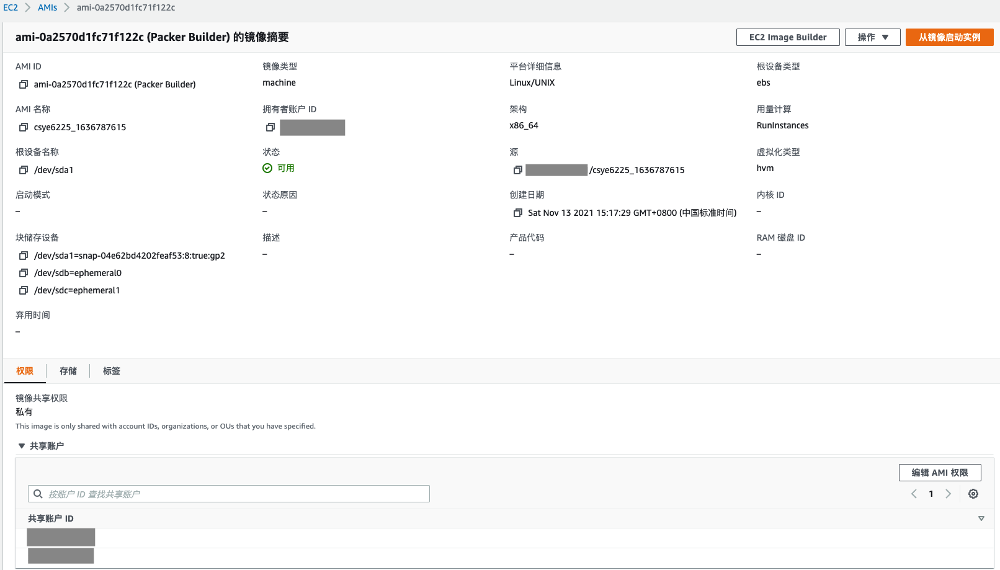


## EC2(计算实例)

本部分在子项目[infrastructure](https://github.com/Captain32/infrastructure)中实现。

EC2是AWS提供的虚拟计算环境，也称为实例，可以通过镜像AMI启动，本项目的Web应用就是运行在EC2实例上，EC2也提供了公网ip，做为开发者也可以打开ssh(端口22)权限，远程登陆到EC2实例上进行操作。

在子项目[infrastructure](https://github.com/Captain32/infrastructure)中，通过配置资源`aws_instance`来配置EC2实例，由于项目更新为使用自动扩缩容组(auto scaling group)来动态管理计算资源，所以EC2实例的配置使用资源`aws_launch_configuration`实现，在配置中可以指定EC2实例的启动镜像(AMI，使用上一节创建的镜像)、权限(IAM角色后续会提到)、远程ssh登陆密钥、安全组(VPC介绍中提到过，`aws_security_group`中配置，可以限制出入流量的ip、端口)、User Data(启动实例后自动运行，用于初始化，比如数据库地址等环境变量设置)、存储卷等。这样就配置好了将要启动的EC2实例，代码详见子项目[infrastructure](https://github.com/Captain32/infrastructure)，运行代码后效果如下：

可以看到Auto Scaling Group使用Launch Config创建了3个EC2实例，每个实例的配置都是一样的，可以通过每个实例的公网IP远程登陆到机器，如下：


运行代码后，也可以看到我们创建的Launch Config，如下：


其中用户数据就是配置中的User Data，这里放了一个shell脚本，目的是每次启动EC2实例时把数据库等配置信息存入环境变量，方便随后启动的Web应用使用，如下：
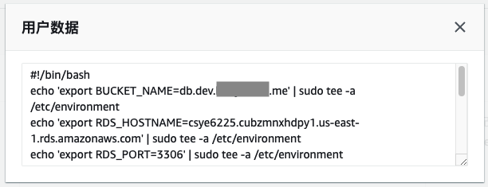

## RDS(关系型数据库)

本部分在子项目[infrastructure](https://github.com/Captain32/infrastructure)中实现。

RDS是AWS提供的关系型数据库实例，AWS的RDS目前普遍使用Aurora论文中的架构，将计算和存储分离，可以在一个计算层写副本上扩展多个读副本，由于存储层没有改变，所以读副本的添加只会带来较小的延迟，4个读副本和1个写副本的延迟在20ms以内(论文中的数据)，大大缓解读请求压力，再加上日志即数据库的理念，减少网络I/O，比原始的分布式MySQL实现有很大的性能提升，具体架构可以读AWS团队的Aurora论文。

在子项目[infrastructure](https://github.com/Captain32/infrastructure)中，通过配置资源`aws_db_instance`来配置RDS实例以及读副本，其中包括RDS的引擎、子网组、可用区(多个可用区同时发生故障可能性小)、安全组、用户名、密码、参数组、存储容量、存储加密密钥等。代码详见子项目[infrastructure](https://github.com/Captain32/infrastructure)，运行代码后效果如下：

这里创建了一个写副本和一个读副本，分处两个可用区来追求更高的可用性，配置都是几乎相同的，如下：


对于RDS，还配置了其子网组，达到连入VPC的目的，如下：


## Load Balancer(负载均衡)

本部分在子项目[infrastructure](https://github.com/Captain32/infrastructure)中实现。

Load Balancer也是VPC的一部分，它负责监听外部请求，并将请求分发给对应的实例，因为实例可能是多个，所以Load Balancer也会均衡实例的负载。

在子项目[infrastructure](https://github.com/Captain32/infrastructure)中，通过配置资源`aws_lb`来配置Load Balancer，其中包括安全组、子网等，同时通过配置资源`aws_lb_target_group`可以配置请求转发的目标组，也就是稍后会介绍的Auto Scaling Group。代码详见子项目[infrastructure](https://github.com/Captain32/infrastructure)，运行代码后效果如下：


## Auto Scaling Group(自动扩缩容)

本部分在子项目[infrastructure](https://github.com/Captain32/infrastructure)中实现。

Auto Scaling Group可以通过配置启动EC2实例的Launch Config、扩容策略、缩容策略来达到动态启动、下线EC2实例的目标。通过配置资源`aws_autoscaling_group`来配置Auto Scaling Group，其中包括Launch Config、最小容量、最大容量、子网、负载均衡目标组等。代码详见子项目[infrastructure](https://github.com/Captain32/infrastructure)，运行代码后效果如下：


扩缩容策略则可以通过配置资源`aws_autoscaling_policy`实现，策略的应用则由资源`aws_cloudwatch_metric_alarm`来激活，本项目中通过监控CPU使用率来衡量是否扩缩容，如下：

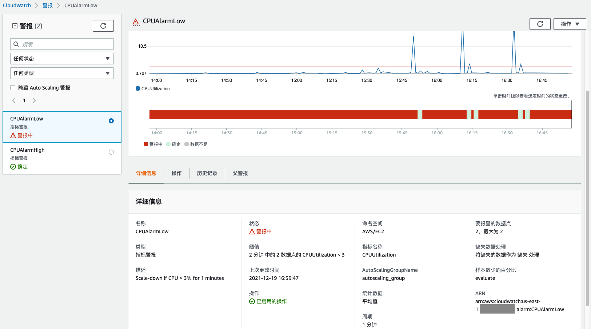
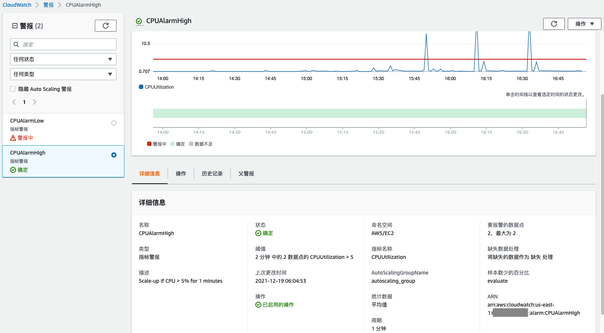

本项目通过JMeter(脚本`jmeter_test.jmx`在子项目[webapp](https://github.com/Captain32/webapp)中)进行压测，可以实现EC2实例的自动扩缩容。

## Certificate(证书管理)

本部分通过手动配置实现。

由于需要通过HTTPS访问服务，SSL协议需要认证证书，项目通过AWS Certificate Manager可以申请到一个受限的证书，需要浏览器额外信任，如下：


出于安全考虑EC2实例和RDS数据库的连接也要加上SSL层，为了让RDS实例信任EC2实例，可以通过下载AWS提供的[根证书](https://s3.amazonaws.com/rds-downloads/rds-ca-2019-root.pem)，生成Java可用的Java Keystore文件，在Web应用连接RDS时带上证书即可完成认证，获得更加安全的SSL加密连接，本项目使用的`clientkeystore.jks`放在子项目[webapp](https://github.com/Captain32/webapp)中。

## Route53(域名管理)

本部分在子项目[infrastructure](https://github.com/Captain32/infrastructure)中实现，外加手动。

Route53是AWS中用于管理域名的组件，当然管理域名首先需要有域名，本项目在[Namecheap](https://www.namecheap.com/)上申请了一个域名`example.me`，随后需要在Route53上登记申请的域名，如下：

其中`dev.example.me`和`prod.example.me`是`example.me`的子域名，分别在开发和正式中使用，`example.me`的配置如下：

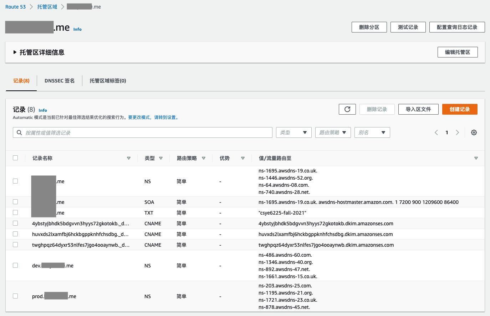
其中域名为`example.me`的NS记录是在Route53创建域名时自动分配的四台名称服务主机，上层的NS指向这四台机器就可以把请求从上曾路由过来，因为本项目域名是从Namecheap申请的，所以按照[Namecheap配置DNS](https://www.namecheap.com/support/knowledgebase/article.aspx/767/10/how-to-change-dns-for-a-domain/)中的自定义CustomDNS配置上这四台机器即可。同理，由于`example.me`是`dev.example.me`和`prod.example.me`的上层，所以分别为两个子域名配置了另外两个NS记录，指向它们各自的NS服务器。SOA记录表示了域名区的权限、Zone管理者、序列编号、更新时间、重试时间、有效时间。TXT记录就是单纯的字符串，可以通过[测试工具](https://toolbox.googleapps.com/apps/dig/#TXT/)去测。CNAME记录是配置的是DKIM，DKIM是一种电子邮件进行身份验证的方法，后续会介绍。

子域名`dev.example.me`的配置(`prod.example.me`类似)如下：
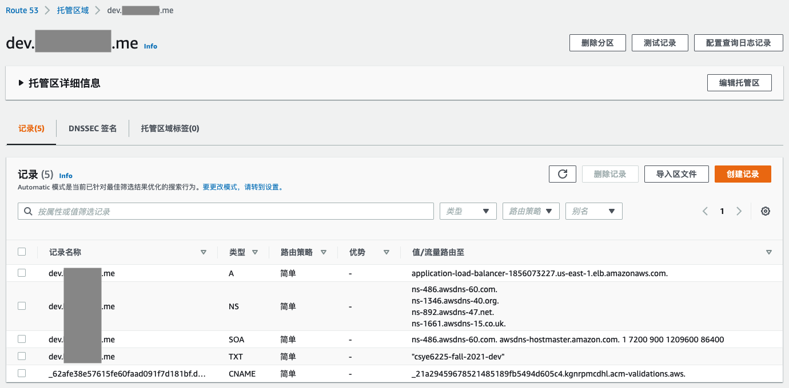
其中A记录是IPv4地址，这里配置的是之前介绍的Load Balancer的地址，如此我们便可以通过域名`dev.example.me`来访问项目中运行在EC2实例上的Web应用了！CNAME记录配置的是之前申请的SSL证书，用于HTTPS访问服务时的证书认证。

至此，便有了项目的一个基本的架构，可以外部通过HTTPS访问Web服务，Postman修改用户信息接口测试如下：

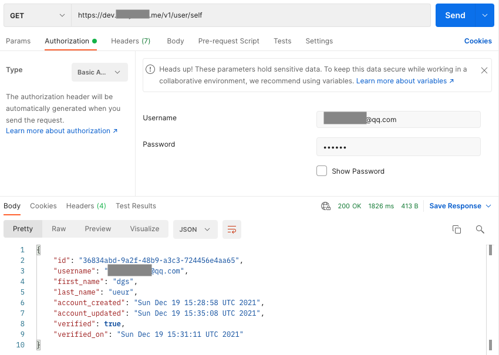

## S3(对象存储桶)

本部分在子项目[infrastructure](https://github.com/Captain32/infrastructure)中实现。

S3是一种对象存储服务，使用上很像是远程云盘，能够用常见的文件路径形式存取文件，在本项目中，共使用了两个S3对象存储桶，其中一个用于Web应用中存取用户文件，还有一个用于后续介绍的CodeDeploy(代码自动部署)和Lambda服务(Serverless服务)。

在子项目[infrastructure](https://github.com/Captain32/infrastructure)中，通过配置资源`aws_s3_bucket`创建S3存储桶，包括存储的加密密钥、转存周期配置、日志等。代码详见子项目[infrastructure](https://github.com/Captain32/infrastructure)，运行代码后效果如下：
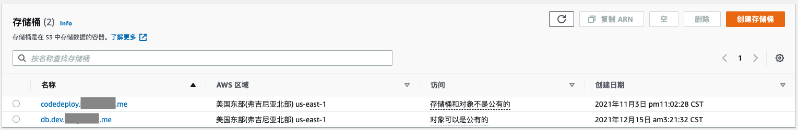

在Postman中测试Web应用存、取、删文件的示例如下：

1.存文件


2.取文件
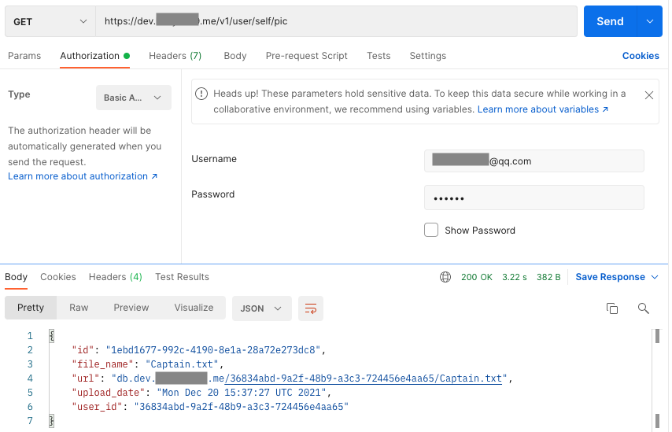

3.删文件


## IAM(权限管理)

本部分在子项目[infrastructure](https://github.com/Captain32/infrastructure)、[ami-infrastructure](https://github.com/Captain32/ami-infrastructure)、[app-cicd](https://github.com/Captain32/app-cicd)中实现。

在前面的介绍中，其实一直跳过了一个重要的部分，就是权限控制，IAM组件就是做这样一个工作的。

先介绍一下IAM中的几个名词：
    
* 账户(account)：代表了具体的一个用户，不是指代AWS账号，这里很容易模糊，一个账户比如在公司里就是分配给一个人，这个账户可以有一系列的权限等等，而AWS账号是公司所有。每个账户都会在创建时ACCESS_KEY和SECRET_KEY，用于账户的认证，后续CI/CD中会再次提到。
* 角色(role)：是一个虚拟主体，并不直接对应一个用户，角色可以被分配各种权限、策略，账户做为实际主体可以通过被授予角色而拥有角色所有的权限。
* 权限(permission)：指各个组件的增删改查等等权限，是非常细粒度的划分，可以给账户、角色授予权限，同时也可以组成策略。
* 策略(policy)：策略是一系列权限、自策略的组合，可以打包出做某件事所需要的所有权限形成一个策略，这样给账户、角色分配的时候就变得更加简单了。

所以最开始提到的root、dev、prod都是账户，分别给它们配置了角色，这里为了方便分配了管理员权限，实际不能这样，如下：
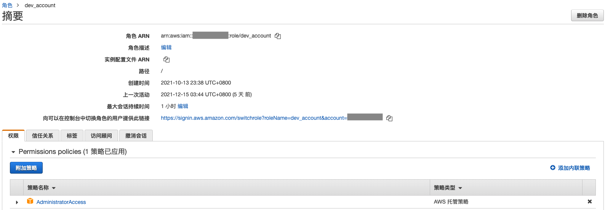
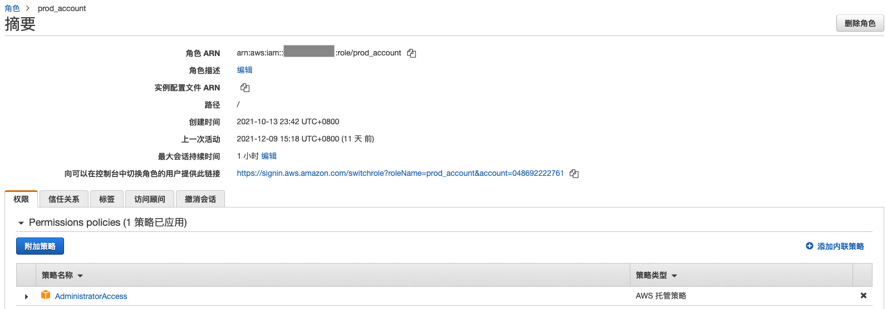

在子项目[infrastructure](https://github.com/Captain32/infrastructure)中创建了EC2、Lambda、CodeDeploy的相应策略和角色，在子项目[ami-infrastructure](https://github.com/Captain32/ami-infrastructure)和子项目[app-cicd](https://github.com/Captain32/app-cicd)中分别创建了Github上对Web应用和AMI镜像部署权限的相应策略(Github对应的账户已经提前通过手动创建)。代码详见各自对应的子项目。

EC2实例的角色和挂在上面的策略，如下：
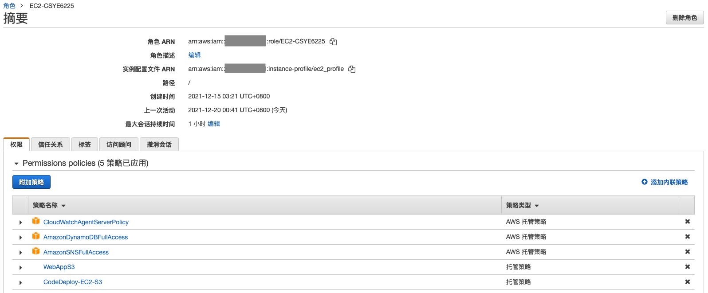

Lambda服务的角色和挂在上面的策略，如下：


CodeDeploy的角色和挂在上面的策略，如下：


CI/CD相关的Github账户和对应策略，如下：


## CI/CD(持续集成/持续部署)

本部分在子项目[webapp](https://github.com/Captain32/webapp)、[infrastructure](https://github.com/Captain32/infrastructure)、[ami](https://github.com/Captain32/ami)、[ami-infrastructure](https://github.com/Captain32/ami-infrastructure)、[app-cicd](https://github.com/Captain32/app-cicd)、[serverless](https://github.com/Captain32/serverless)中实现。

CI/CD即持续集成、持续部署，在持续集成环境中，开发人员将会频繁的提交代码到主干。这些新提交在最终合并到主线之前，都需要通过编译和自动化测试流进行验证。持续部署则是合并到主干的代码会自动化的部署在服务主机上，达到服务随代码自动更新。

为了实现CI/CD，本项目使用了Github的Workflow，在子项目[webapp](https://github.com/Captain32/webapp)、[ami](https://github.com/Captain32/ami)、[serverless](https://github.com/Captain32/serverless)这三个需要CI/CD的仓库中，都添加了`.github/workflows`目录，其中的yml文件可以通过特定的Github动作触发相应的动作，进而达到CI/CD的目标。具体的workflow代码在各子项目下，基本思路都是发起pull
request便进行编译、测试检查，合并到主分支则进行自动部署，其中Web应用是会将打包的jar包上传到S3存储桶，并触发AWS的CodeDeploy组件自动部署；AMI镜像则是调动AWS根据hcl代码build出镜像并存储；Serverless服务则是将代码打包上传到S3存储桶，触发Lambda服务运行新的代码。

其中CodeDeploy需要知道拿到S3上的代码包应该如何启动或者关闭应用，所以需要在子项目[webapp](https://github.com/Captain32/webapp)中给CodeDeploy提供这样的信息，这些信息存储在`appspec.yml`和`scripts`目录下，告诉了CodeDeploy启动、关闭应用的具体步骤。

上文IAM介绍中已经说明了如何给Github分配进行CI/CD时所需要的权限，随后在对应的仓库设置里配置好用于账户认证的ACCESS_KEY和SECRET_KEY即可，通过这样的认证方式便可以让Github的Workflow执行AWS命令时有对应的权限，Github环境变量的配置如下：


现在万事具备，只欠东风，还需要完成对CodeDeploy组件的配置，才能完成Workflow的最后一环——自动部署，CodeDeploy的通过配置资源`aws_codedeploy_app`完成，这里只配置了部署类型，还需要配置具体的自动部署组`aws_codedeploy_deployment_group`，其中配置了角色、Auto Sacling组、服务器过滤条件、部署方式、回滚设置等。代码详见子项目[infrastructure](https://github.com/Captain32/infrastructure)，运行代码后效果如下：

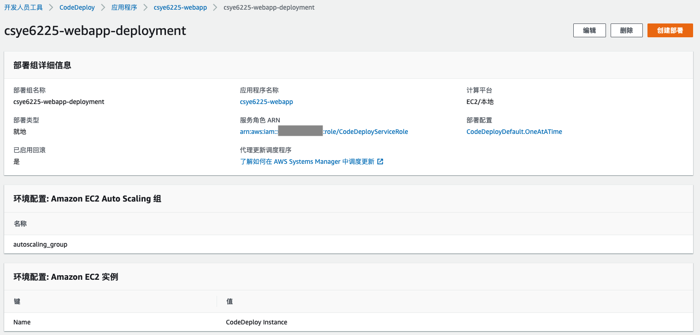

最后就是真正在Github上发生相应动作触发Workflow便可以实现CI/CD了，如下：

1.Web应用


2.AMI镜像


3.Lambda服务


## SNS(消息队列)

本部分在子项目[infrastructure](https://github.com/Captain32/infrastructure)中实现。

SNS是AWS提供的消息队列组件，本项目中消息队列是用于用户在Web应用注册时将发送认证邮件的工作发给Lambda服务完成，达到异步处理的效果。SNS消息队列主题的创建通过配置资源`aws_sns_topic`完成。代码详见子项目[infrastructure](https://github.com/Captain32/infrastructure)，运行代码后效果如下：
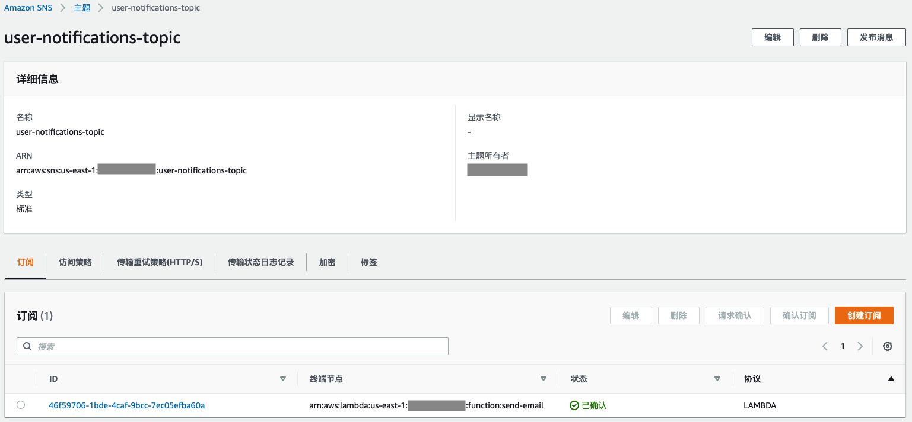

## DynamoDB(KV数据库)

本部分在子项目[infrastructure](https://github.com/Captain32/infrastructure)中实现。

DynamoDB是AWS提供的键值数据库，用户点击认证邮件的链接不会永久有效，利用DynamoDB中为键值对设置TTL时间完成认证链接的自动过期功能。代码详见子项目[infrastructure](https://github.com/Captain32/infrastructure)，运行代码后效果如下：


## Lambda(无服务器计算)

本部分在子项目[infrastructure](https://github.com/Captain32/infrastructure)和[serverless](https://github.com/Captain32/serverless)中实现。

Lambda服务是AWS提供的很轻量级的服务，贯彻了Serverless的思想，用户不需要关心机器，只需要提供代码即可启动服务。本项目使用Lambda服务完成给用户发认证邮件的功能，功能代码实现以及CI/CD在子项目[serverless](https://github.com/Captain32/serverless)中；Lambda服务的创建与配置在子项目[infrastructure](https://github.com/Captain32/infrastructure)的`aws_lambda_function`中完成，并且监听了之前创建的消息队列SNS的topic。运行代码后效果如下：
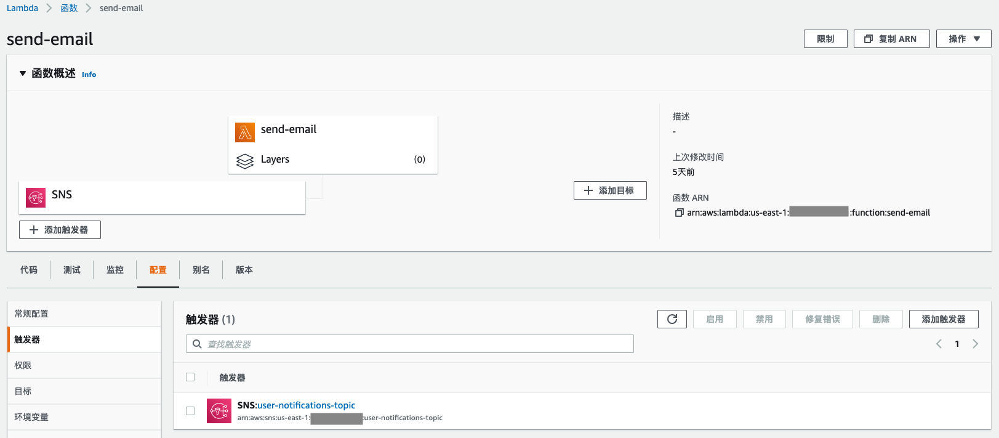


## SES(邮件系统)

本部分通过手动配置实现。

SES服务是AWS提供的发送邮件的服务，通过为`example.me`域名在SES中认证可以获得用于认证该域名的DKIM，这也是在Route53小节中DKIM的来源，如下：
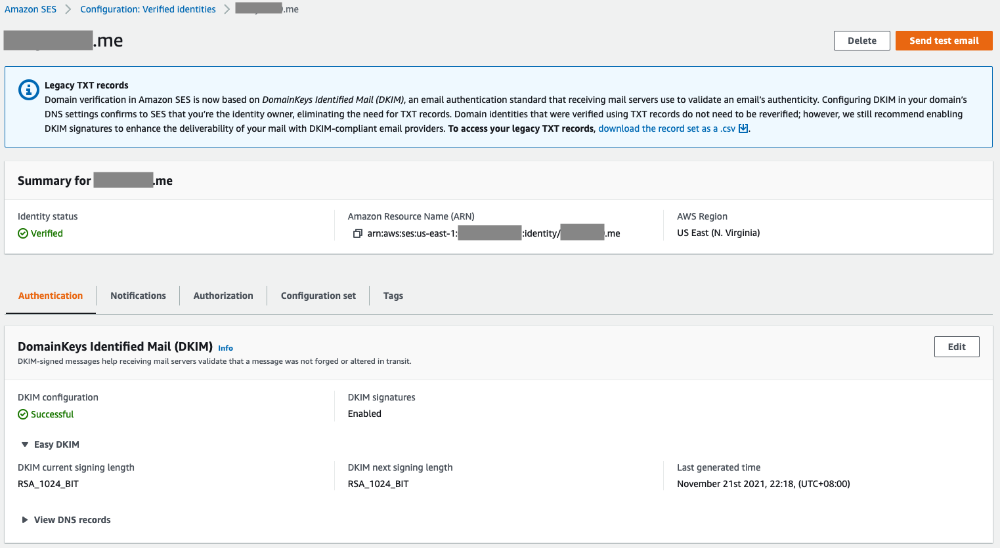

由于项目的Web服务处在沙箱之中，为了避免给其他用户带来垃圾邮件，AWS只允许服务给已认证的邮箱发送邮件，所以还需要认证一下自己的邮箱，如下：
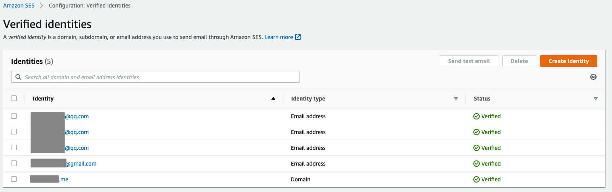

做完这些手动工作后，项目的Web服务就可以成功给用户发送认证邮件了，流程为用户注册，随后Web应用通过SNS将任务派发给Lambda服务，随后Lambda服务调用SES组件发送邮件，用户点击链接后，Web应用检查token在DynamoDB中是否失效，没有失效则认证成功，用户成功完成注册。使用Postman测试如下：

1.用户注册，此时尚未认证，verified为false


2.用户收到邮件
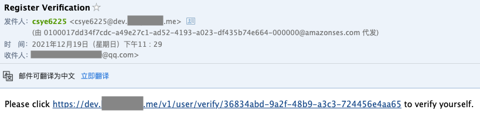

3.用户点击认证链接


4.再次查询用户信息，verified为true
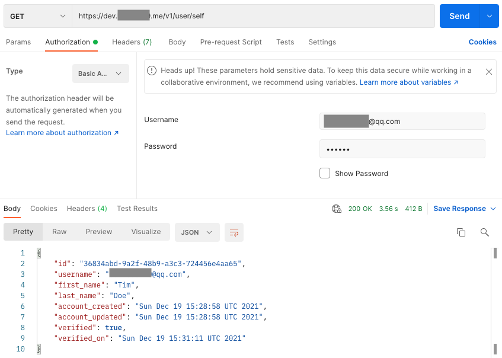

## CloudWatch(日志&打点)

本部分在子项目[webapp](https://github.com/Captain32/webapp)和[ami](https://github.com/Captain32/ami)中实现。

AWS的日志和打点组件需要在服务器上安装`amazon-cloudwatch-agent`，这里放在AMI镜像中进行安装。对于CloudWatch的配置则放在子项目[webapp](https://github.com/Captain32/webapp)的`cloudwatch-config.json`中，配置了打点、日志收集的间隔，以及日志流的存放位置。打点Metric的数据记录则使用StatsD包提供的count、timer等类型在应用Java代码中完成，详情见代码。效果如下：


## KMS(密钥管理)

本部分在子项目[infrastructure](https://github.com/Captain32/infrastructure)中实现。

KMS组件是AWS中管理密钥的组件，处于安全考虑，需要把EC2实例、RDS实例、S3存储桶的存储都进行密钥加密，从而达到即使泄漏原始存储数据也不会扩大安全方面的影响。通过配置资源`aws_ebs_default_kms_key`、`aws_kms_key`等创建密钥，并相应的应用到EC2、RDS、S3的存储上。代码详见子项目[infrastructure](https://github.com/Captain32/infrastructure)，运行代码后效果如下：

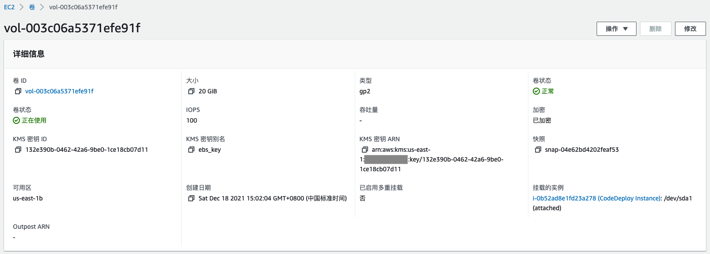

从之前EC2、RDS、S3的截图也可以看出对存储进行了加密。
